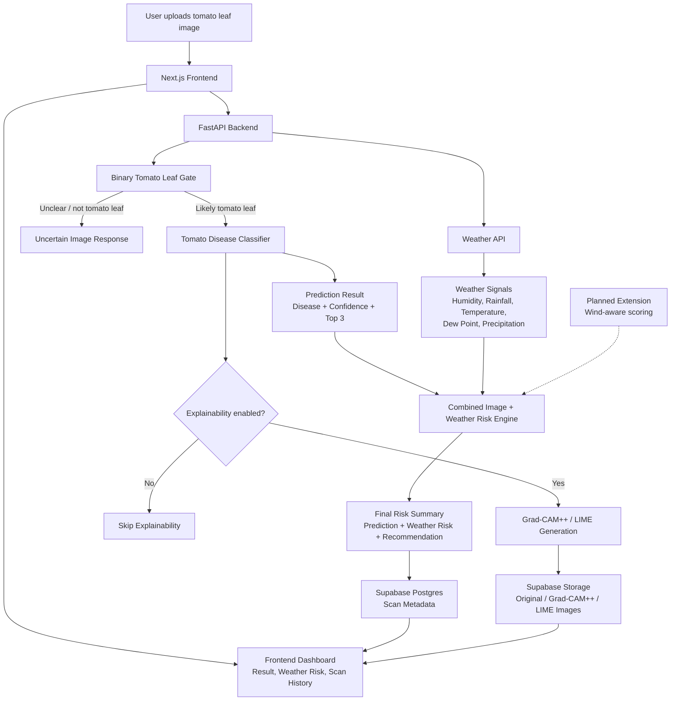

# TomaDoctor! 🍅🍅🍅

AI-powered tomato plant health assistant for farmers and home gardeners.

## Overview

TomaDoctor helps users screen tomato leaf photos for common tomato diseases, understand weather-based disease pressure, and track plant health over time. A user uploads a tomato leaf image, the app checks whether the image appears to contain a clear tomato leaf, runs a tomato disease classifier, and returns a prediction with confidence, top matches, interpretability views, and practical next steps.

The app also adds local forecast context. Humidity, rainfall, temperature, dew point, and related wetness signals are used to estimate tomato disease weather risk, so image results can be interpreted alongside field conditions. Wind can affect field drying and spray drift in real agricultural decision-making, but the current backend scoring formula does not yet include wind.

TomaDoctor is built for farmers, greenhouse operators, students, and home gardeners who want fast decision support. It is an AI screening tool, not a certified agricultural diagnosis, laboratory test, or replacement for local extension-service guidance.

## Features

- Tomato leaf disease image classification.
- Binary tomato-leaf gate before disease classification.
- Confidence score and top 3 predictions.
- Low-confidence and unclear-image handling for blurry, small, uncertain, or non-tomato images.
- Weather-based tomato disease risk scoring.
- Combined image + weather risk interpretation.
- Grad-CAM++ AI attention maps.
- LIME superpixel explanations.
- Scan history with Supabase.
- Original image, Grad-CAM++, and LIME image storage.
- Mobile-responsive agriculture dashboard UI.
- Anonymous browser `session_id` for scan history before full authentication.

## Demo

- Live demo: [Live Demo Coming Soon]

### Dashboard


### Leaf Analysis


### Weather Risk


### Scan History


## Tech Stack

Frontend:

- Next.js
- TypeScript
- Tailwind CSS
- Recharts
- lucide-react

Backend:

- FastAPI
- PyTorch
- torchvision
- Pillow
- OpenCV
- LIME
- Grad-CAM++

Database / Storage:

- Supabase Postgres
- Supabase Storage

External APIs:

- Open-Meteo Forecast API
- Open-Meteo Geocoding API
- OpenStreetMap Nominatim reverse geocoding

## Architecture

TomaDoctor uses a Next.js frontend, a FastAPI/PyTorch inference backend, external weather data, and Supabase for scan history and image storage.

The backend first validates whether the image is likely to be a tomato leaf, then runs disease classification, optional explainability, weather-risk scoring, and scan persistence.



## Model

Task: tomato leaf disease classification.

Model architecture:

- Disease classifier: MobileNetV2 with a replaced final classifier layer.
- Binary gate: MobileNetV2 with a replaced final classifier layer for `Not_Tomato_Leaf` vs `Tomato_Leaf`.
- Input size: `224x224`.
- Normalization: ImageNet normalization.

Dataset:

- Expected project dataset path: `backend/data/tomato/`.
- Tomato disease images come from the PlantVillage Dataset on Kaggle: <https://www.kaggle.com/datasets/emmarex/plantdisease>.
- `Not_Tomato_Leaf` negative examples come from Kaggle PlantDoc and gardenscape image datasets:
  - <https://www.kaggle.com/datasets/abdulhasibuddin/plant-doc-dataset>
  - <https://www.kaggle.com/datasets/programmer3/gardenscape-dataset>
- The prepared project data uses PlantVillage-style tomato folders plus a `Not_Tomato_Leaf` folder for the binary gate.
- Prepared split size: `83,159` images across `train`, `val`, and `test`, excluding filesystem metadata files.
- Tomato disease classifier data: `16,011` PlantVillage tomato leaf images across 10 disease/healthy classes.
- Binary tomato-leaf gate data: `16,011` tomato leaf images and `67,148` `Not_Tomato_Leaf` images.

Disease classes:

- Healthy
- Bacterial Spot
- Early Blight
- Late Blight
- Leaf Mold
- Septoria Leaf Spot
- Spider Mites
- Target Spot
- Yellow Leaf Curl Virus
- Tomato Mosaic Virus

The model was trained on curated tomato leaf images and may perform worse on real-world photos with blur, poor lighting, occlusion, unusual leaf angles, mixed backgrounds, or multiple leaves in frame.

Training commands from `backend/`:

```bash
source venv/bin/activate
python ml/prepare_data_dirs.py
NUM_WORKERS=0 python ml/train_leaf_binary.py
NUM_WORKERS=0 OMP_NUM_THREADS=1 MKL_NUM_THREADS=1 python ml/evaluate_leaf_binary.py
python ml/train.py
NUM_WORKERS=0 OMP_NUM_THREADS=1 MKL_NUM_THREADS=1 python ml/evaluate.py
```

The app runs the binary model first:

1. `tomato_leaf_binary_model.pth` decides whether the image is a tomato leaf.
2. `tomato_model.pth` classifies disease only if the binary gate accepts the image as a tomato leaf.

## Weather Risk

Weather risk uses Open-Meteo forecast data and rule-based scoring. The backend summarizes forecast days using:

- Relative humidity
- Rain probability
- Precipitation
- Temperature
- Dew point / near-saturation signals

Wind is not currently part of the scoring formula in code; it is listed as a future weather-signal improvement.

High humidity, recent or expected rainfall, and warm disease-favorable temperatures can increase fungal and bacterial disease pressure. Weather risk does not confirm disease by itself; it only adds environmental context.

The code scores daily disease pressure using humid hours, precipitation/rain probability, and temperature range. It then scores disease-specific profiles for:

- Late blight
- Early blight
- Septoria leaf spot
- Leaf mold
- Bacterial spot

Current rule summary:

```text
Daily pressure:
- Humid or near-dew-point hours add risk.
- Rain probability or precipitation adds risk.
- Tomato disease-favorable temperatures add risk.

Disease profile score:
- Wet/humid forecast days and disease-specific favorable temperature days add points.
- Scores are capped at 100.
- Risk levels:
  - low: < 40
  - moderate: 40-69
  - high: >= 70
```

## Explainability

TomaDoctor includes two optional interpretability tools:

- Grad-CAM++ highlights broad image regions that influenced the CNN prediction.
- LIME highlights superpixel regions that affected the model output.

These tools help users understand what the model appeared to rely on. They are not exact disease segmentation, lesion detection, or proof that highlighted regions are diseased.

## Scan History

Saved scans include:

- Original uploaded image
- Prediction
- Confidence
- Weather risk
- Combined risk score
- Grad-CAM++ image
- LIME image
- Top predictions
- Explanation and next steps
- Timestamp

Metadata is stored in Supabase Postgres. Uploaded images, Grad-CAM++ overlays, and LIME explanations are stored in Supabase Storage and referenced by URL.

The current app uses an anonymous `session_id` stored in browser `localStorage`. Saved scans are tied to that local browser session. A future version can use Supabase Auth and Row Level Security for real user accounts.

## Local Setup

Backend:

```bash
cd backend
python -m venv venv
source venv/bin/activate
pip install -r requirements.txt
uvicorn app.main:app --reload --port 8000
```

Frontend:

```bash
cd frontend
npm install
npm run dev
```

Open:

- Dashboard: `http://localhost:3000`
- Scanner: `http://localhost:3000/scanner`
- Weather risk: `http://localhost:3000/weather-risk`
- Scan history: `http://localhost:3000/history`

Useful backend endpoints:

- `GET /`
- `GET /health`
- `GET /classes`
- `POST /predict`
- `POST /weather-risk`
- `GET /weather-locations`
- `POST /scans`
- `GET /scans/{session_id}`
- `DELETE /scans/{scan_id}`

## Environment Variables

Backend `.env` example:

```bash
APP_ENV=development
FRONTEND_ORIGIN=http://localhost:3000
SUPABASE_URL=https://your-project.supabase.co
SUPABASE_SERVICE_ROLE_KEY=your-service-role-key
SUPABASE_BUCKET_NAME=scan-images
```

Frontend `.env.local` example:

```bash
NEXT_PUBLIC_API_URL=http://localhost:8000
NEXT_PUBLIC_SUPABASE_URL=https://your-project.supabase.co
NEXT_PUBLIC_SUPABASE_PUBLISHABLE_KEY=your-publishable-key
```

`SUPABASE_SERVICE_ROLE_KEY` must stay on the backend only. Never expose it in the frontend and never prefix it with `NEXT_PUBLIC_`.

The weather service URLs are currently defined in code for Open-Meteo and Nominatim; no `WEATHER_API_URL` variable is required by the current backend.

## Supabase Setup

1. Create a Supabase project.
2. Create the scans table.
3. Create a Storage bucket named `scan-images`.
4. Add backend environment variables.
5. Run the backend and frontend.

This repo includes `backend/supabase/schema.sql`. Run that file in the Supabase SQL Editor.

The schema creates `public.scans`, enables `pgcrypto`, and adds an index for recent scans by `session_id`.

Current schema:

```sql
create extension if not exists pgcrypto;

create table if not exists public.scans (
  id uuid primary key default gen_random_uuid(),
  session_id text not null,
  image_url text,
  gradcam_url text null,
  lime_url text null,
  prediction text,
  raw_label text null,
  confidence float,
  is_confident boolean,
  weather_risk text null,
  weather_risk_score float null,
  combined_risk_score float null,
  temperature float null,
  humidity float null,
  rainfall float null,
  latitude float null,
  longitude float null,
  location_name text null,
  top_predictions jsonb not null default '[]'::jsonb,
  explanation text null,
  next_steps jsonb not null default '[]'::jsonb,
  disclaimer text null,
  created_at timestamptz default now()
);

create index if not exists scans_session_created_at_idx
  on public.scans (session_id, created_at desc);
```

Storage setup:

1. In Supabase, open Storage.
2. Create a bucket named `scan-images`.
3. Make the bucket public so thumbnails and explanation images can be shown in the frontend.

Backend uploads use paths like:

```text
{session_id}/{scan_id}/original.png
{session_id}/{scan_id}/gradcam.png
{session_id}/{scan_id}/lime.png
```

## Model Performance

Disease classifier results from `backend/ml/evaluate.py` on the clean test set:

- Training accuracy: [Placeholder]
- Validation accuracy: [Placeholder]
- Test accuracy: `0.9548`
- Macro F1-score: `0.9515`
- Weighted F1-score: `0.9547`
- Test samples: `2,411`
- Binary tomato-leaf gate metrics: [Placeholder]
- Stress-test results: generated with `backend/ml/evaluate_stress_test.py`

Per-class disease classifier report:

| Class | Precision | Recall | F1-score | Support |
|---|---:|---:|---:|---:|
| Tomato___healthy | 0.9228 | 0.9958 | 0.9579 | 240 |
| Tomato___Bacterial_spot | 0.9618 | 0.9437 | 0.9527 | 320 |
| Tomato___Early_blight | 0.9688 | 0.8267 | 0.8921 | 150 |
| Tomato___Late_blight | 0.9495 | 0.9826 | 0.9658 | 287 |
| Tomato___Leaf_Mold | 0.9858 | 0.9653 | 0.9754 | 144 |
| Tomato___Septoria_leaf_spot | 0.9283 | 0.9700 | 0.9487 | 267 |
| Tomato___Spider_mites Two-spotted_spider_mite | 0.9703 | 0.9087 | 0.9385 | 252 |
| Tomato___Target_Spot | 0.8783 | 0.9528 | 0.9140 | 212 |
| Tomato___Tomato_Yellow_Leaf_Curl_Virus | 1.0000 | 0.9751 | 0.9874 | 482 |
| Tomato___Tomato_mosaic_virus | 0.9825 | 0.9825 | 0.9825 | 57 |
| Accuracy |  |  | 0.9548 | 2,411 |
| Macro avg | 0.9548 | 0.9503 | 0.9515 | 2,411 |
| Weighted avg | 0.9563 | 0.9548 | 0.9547 | 2,411 |

Confusion matrix:

```text
[[239   0   0   0   0   0   0   1   0   0]
 [  0 302   1   3   0  10   0   4   0   0]
 [  0   2 124  10   0   6   0   8   0   0]
 [  0   0   3 282   0   0   0   2   0   0]
 [  0   0   0   1 139   2   1   1   0   0]
 [  0   3   0   1   1 259   0   3   0   0]
 [ 14   0   0   0   0   0 229   8   0   1]
 [  6   0   0   0   0   2   2 202   0   0]
 [  0   7   0   0   0   0   4   1 470   0]
 [  0   0   0   0   1   0   0   0   0  56]]
```

Stress-test results:

| Test Set | Images | Accuracy | Macro F1 |
|---|---:|---:|---:|
| Clean Test | 2,411 | 0.9548 | 0.9515 |
| Blur | 1,855 | 0.1477 | 0.0820 |
| JPEG Compression | 1,855 | 0.8528 | 0.8422 |
| Low Light | 1,855 | 0.6992 | 0.6866 |
| Mixed Realistic | 1,855 | 0.3650 | 0.3486 |
| Noise | 1,855 | 0.4404 | 0.4615 |
| Occlusion | 1,855 | 0.9213 | 0.9184 |
| Off-center Crop | 1,855 | 0.7844 | 0.7740 |
| Overexposed | 1,855 | 0.8081 | 0.8018 |

Stress testing can simulate blur, noise, low light, overexposure, JPEG compression, occlusion, and off-center crops. The repo includes stress-test utilities under `backend/ml/`, including `create_stress_test_dataset.py` and `evaluate_stress_test.py`. The disease stress-test evaluator ignores `Not_Tomato_Leaf` folders because the disease classifier is a 10-class tomato disease model; use the binary gate evaluator for tomato-vs-not-tomato performance.

## Limitations

- TomaDoctor is not a certified agricultural diagnostic tool.
- Real-world images may perform worse than curated training data.
- The app focuses on tomato leaves only.
- Grad-CAM++ and LIME are not disease segmentation.
- Weather risk is contextual, rule-based, and approximate.
- Weather risk does not confirm disease by itself.
- The binary tomato-leaf gate can still reject valid images or accept poor images.
- The app does not provide pesticide dosages or chemical treatment prescriptions.

## Future Improvements

- Better tomato leaf validator.
- Improve blur/noise robustness.
- Add more real-world field images.
- User accounts with Supabase Auth.
- Disease risk trend charts.
- PDF scan reports.
- More crops.
- Mobile camera mode.
- SHAP explanations for weather-risk scoring.
- Stronger Supabase Row Level Security policies for authenticated users.

## Disclaimer

TomaDoctor is intended for educational and decision-support purposes only. It does not replace expert agricultural advice, laboratory diagnosis, or local extension service recommendations.
